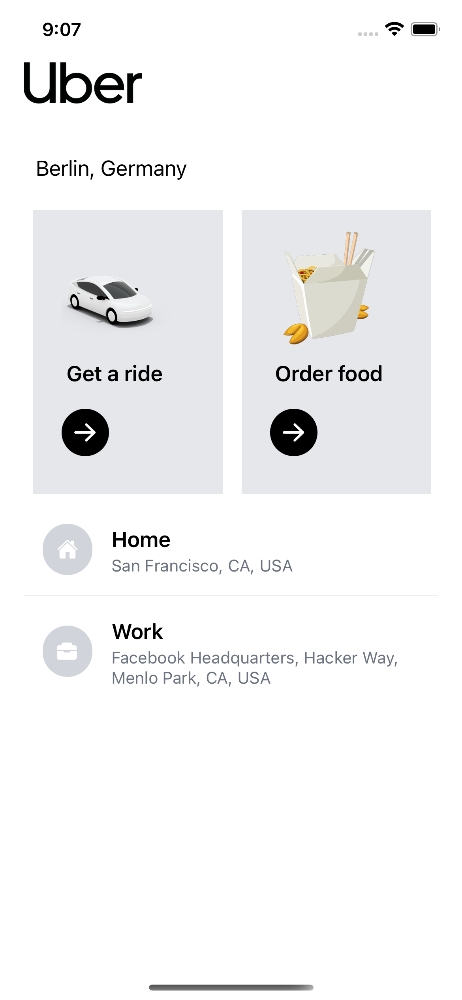
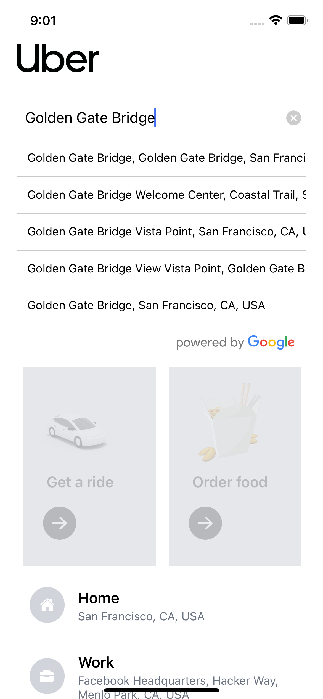
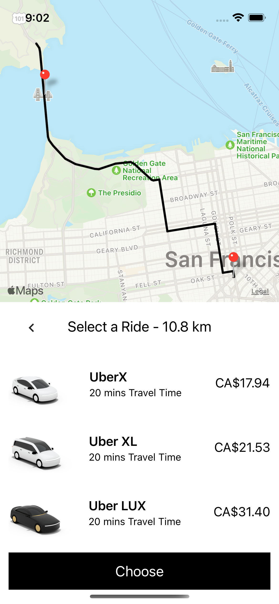

# Get-It-There (Uber Clone)

A easy Uber clone implemented with GooglePlacesAutoComplete (search places) & GoogleDirections (calculate route & travel time & distance).

## Stack

- React Native
- Redux
- Google Map API
- Tailwind CSS

## Screens

